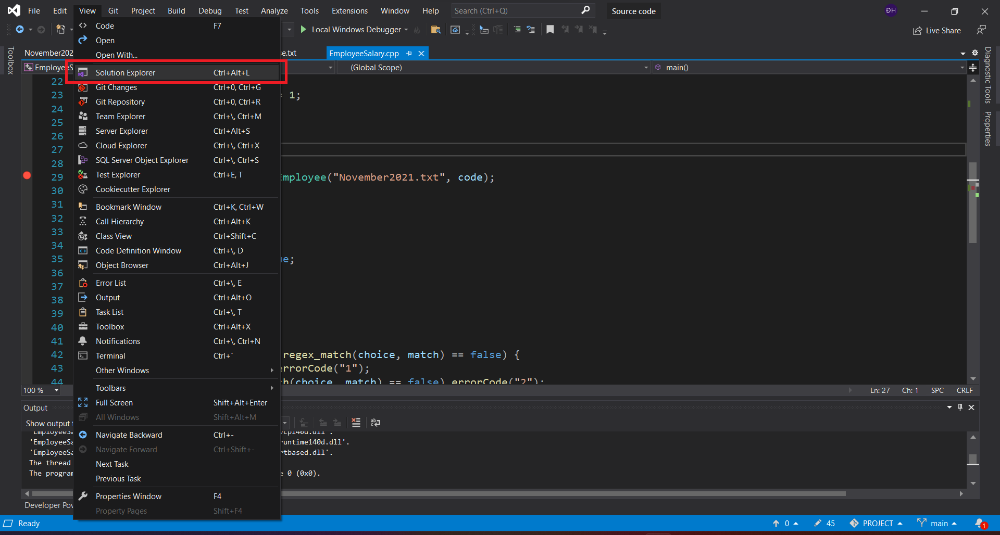
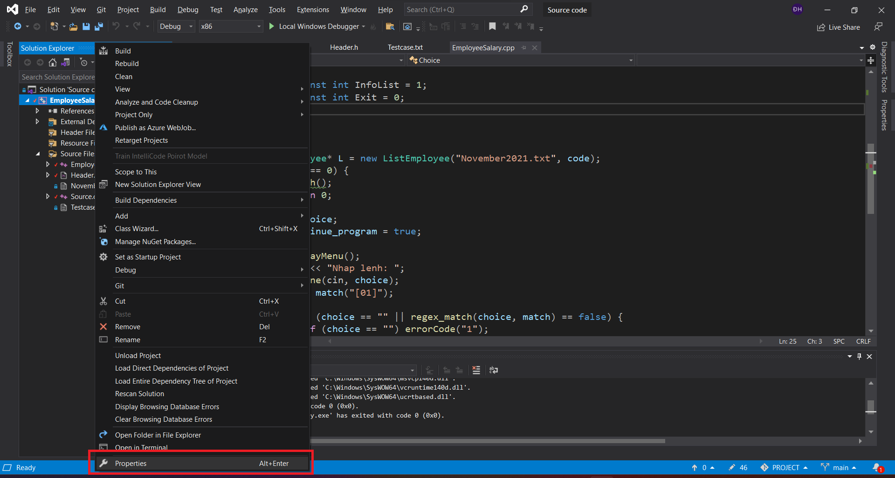
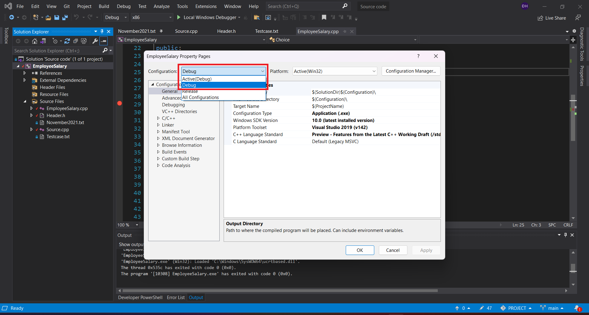
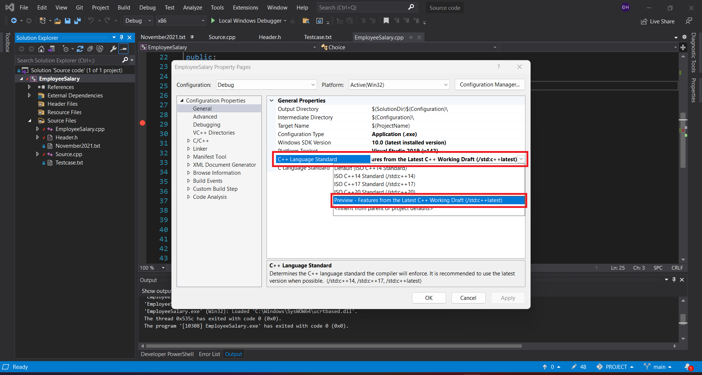
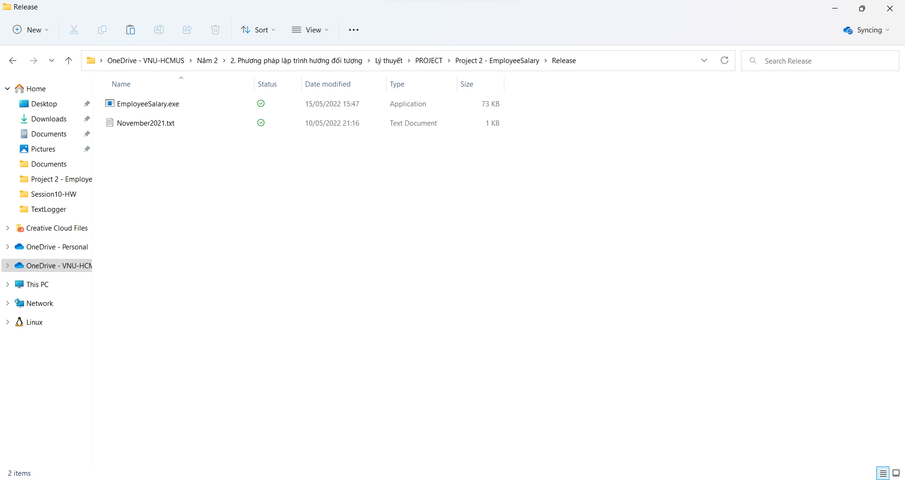

# Member
1. Nguyen Hai Dang - ID: 20120049
2. Le Nguyen Khang - ID: 20120113
# How to run the application
## Debug the application
1. Select "Source code.sln" to enter the solution
2. The application uses C++17 or higher version to debug, so to debug the application need to do the following steps:
   1. View -> Solution Explorer on Menu bar.
      
   2. When the Solution Explorer window appears, left-click the Project name and then press Alt + Enter or right-click the Project name and then click Properties.
      
   3. The Properties window appears, in the Configuration section, click on the list and select Debug.
      
   4. Under Configuration->General->C++Language Standard, click on ...C++17, ...C++20, ... Latest C++ and then click Apply.
      
3. Press F5 or Ctrl+F5 to run.
## Run the application with Release folder
- Select the "Release" folder (2 files: EmployeeSalary.exe and November2021.txt - Data), run the file "EmployeeSalary.exe".

# Project 2: Employee Salary
## Notice
- [x] Completed.
- [ ] Unfinished.
## Content
0. * [X] Version: C++17 and higher version.
1. * [X] Read the file.
2. * [X] Print out all the employees' information and the final payment for each employee.
   1. * [X] Daily employees, get paid by the number of days spent working in a month.
    
         For example, if each day a daily employee is paid 100$, and in this month he worked 28 days. 
    
         The payment for this daily employee will be 100 x 28 = 2.800$.
    
   2. * [X] Hourly employees, get paid by the number of hours spent working in a month.
    
         For example, if in this month an hourly employee worked 1200 hours, and for each hour he will be paid 15$.
    
         The payment for this hourly employee will be 1200 x 15 = 1.800$.
    
   3. * [X] Product employees, get paid by the number of products created in a month.
    
         For example, if this month a product employee created 180 products, and for each product he will be paid 10$.
    
         The payment for this product employee will be 180 * 10 = 1.800$.
    
   4. * [X] Manager, get paid by the number of employees he managed, plus a fixed payment for each month.
    
         For example, if a manager has 20 employees to manage, and for each employee, he will be paid 100$ for management, his fixed payment for a month is 500$.
    
         The payment for this manager this month will be 20 x 100 + 500 = 2500. 
    
   5. * [X] Each employee will have a Fullname.
   
3. Four basic design patterns:
   1. * [ ]  Singleton.
   2. * [X]  Factory.
   3. * [ ]  Prototype.
   4. * [ ]  Builder.
# What should be taken into account for a bonus? 
1. Function Menu (2 functions).
2. Use Regex to check user input.
# Expected Grade
| ID | Name | Expected Grade |
| -- | ---- | ------------ |
|20120049|Nguyen Hai Dang|9.5|
|20120113|Le Nguyen Khang|9.5|
# Video demo LINK
- https://youtu.be/j0eq7MqlqyA
